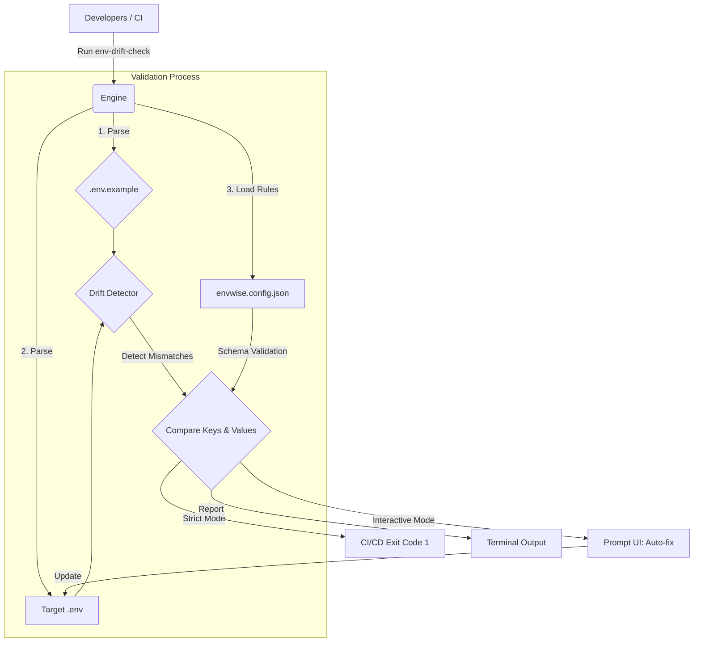

# env-drift-check

<div align="center">

**Detect, validate, and fix environment variable drift --- without breaking your `.env` file.**

[](https://npmjs.org/package/env-drift-check)
[](https://npm-stat.com/charts.html?package=env-drift-check)
[](https://opensource.org/licenses/MIT)

*Eliminate "It works on my machine" errors with automated drift detection and interactive environment synchronization.*

[Installation](#installation) • [Features](#features) • [Quick Start](#quick-start) • [Configuration](#configuration) • [Library Usage](#programmatic-usage) • [Roadmap](#roadmap)

</div>

<div align="center">
  
</div>

---

## ⚡ See It In Action

```bash
npx env-drift-check

✔ Loaded: .env
✔ Base: .env.example

✖ Missing keys:
  - DATABASE_URL
  - STRIPE_SECRET_KEY

⚠ Unused keys:
  - OLD_API_KEY

❌ Validation failed: PORT must be a number
```

👉 **Fix instantly with interactive mode:**

```bash
npx env-drift-check -i
```

---

## 💡 The Problem It Solves

Managing `.env` files across a team of developers or multiple deployment environments (development, staging, production) is notoriously error-prone. 

- **Missing variables** lead to unexpected runtime crashes.
- **Incorrect data types** (e.g., passing a string `"false"` instead of a proper boolean) cause silent logical bugs.
- **Onboarding new developers** often involves insecurely sharing `.env` files over Slack, or fighting with an outdated `.env.example`.

**env-drift-check** bridges this gap. It provides real-time drift detection to ensure your local environments match the blueprint, an interactive CLI to fix missing variables instantly, and a robust schema validator to enforce types and formats.

---

## 🏗 Architecture & Flow



---

## 🚀 Features

- 🔍 **Environment Drift Detection**: Automatically compares your local `.env` against the base `.env.example`. Detects both **missing keys** and **extra/ghost keys**.
- 🛡️ **Extensive Schema Validation**: Enforce `string`, `number`, `boolean`, `enum`, `email`, `url`, and custom `regex` validations via `envwise.config.json`.
- 🪄 **Interactive Auto-fix Wizard**: A beautiful CLI experience that prompts you for missing variables.
- 🔐 **Security Conscious**: Automatically masks inputs for keys containing `SECRET` or `PASSWORD` during interactive setup.
- 📑 **High-Fidelity Formatting**: Inherently preserves your original inline comments, empty lines, bespoke spacing, and absolute key ordering when patching your `.env` file.
- 🔄 **Multi-Environment Support**: Validate all `.env*` files in your project simultaneously with the `--all` flag.
- 🚦 **CI/CD Ready**: Native `--strict` mode to fail builds on validation errors, ensuring zero-drift deployments.

### ✨ Interactive Fix (Best Feature)

```bash
$ npx env-drift-check -i

Missing: DATABASE_URL
Enter value: postgres://localhost:5432/db

✔ Added to .env
✔ All variables synced
```

### How Does It Compare?

| Feature | `dotenv-safe` | `envalid` | **`env-drift-check`** |
| :--- | :---: | :---: | :---: |
| **Missing Keys Detection** | ✅ | ✅ | ✅ |
| **CLI Interactive Fix** | ❌ | ❌ | ✅ |
| **Schema Validation** | ❌ | ✅ (Code) | ✅ (JSON) |
| **Cross-Env File Check** | ❌ | ❌ | ✅ |
| **No Code Integration Needed**| ❌ | ❌ | ✅ |
| **Preserves Formatting** | ❌ | ❌ | ✅ |

👉 **env-drift-check works purely as a standalone CLI tool --- no code changes required!**

---

## 📦 Installation

Install `env-drift-check` as a development dependency:

```bash
npm install --save-dev env-drift-check
```

Or run it directly using `npx` without installing:

```bash
npx env-drift-check init
```

---

## ⚡ Quick Start

### 1. Initialize the Project

Bootstrap your repository with a default configuration and `.env.example`:

```bash
npx env-drift-check init
```

> [!TIP]
> Check out our [Demo Project](https://github.com/shashi089/env-drift-check/tree/main/examples/demo-app) to see how to integrate this into a real application workflow.

*Output:*
```text
✅ Created envwise.config.json
✅ Created .env.example

Setup complete! Run 'npx env-drift-check -i' to sync your .env file.
```

### 2. Run an Interactive Check

If you just cloned a repo, check for missing environment variables and fill them in right from the terminal:

```bash
npx env-drift-check -i
```


Once completed, your `.env` file is automatically updated!


---

## ⚙️ Configuration (`envwise.config.json`)

To unlock the full power of the schema validator, define rules in an `envwise.config.json` file at the root of your project.

### Sample Configuration

```json
{
  "baseEnv": ".env.example",
  "rules": {
    "PORT": { 
      "type": "number", 
      "min": 1024, 
      "max": 65535,
      "description": "The port the HTTP server binds to"
    },
    "NODE_ENV": { 
      "type": "enum", 
      "values": ["development", "production", "test", "staging"] 
    },
    "DEBUG_MODE": { 
      "type": "boolean", 
      "mustBeFalseIn": "production" 
    },
    "DATABASE_URL": { 
      "type": "url",
      "required": true
    },
    "ADMIN_EMAIL": {
      "type": "email"
    },
    "API_KEY": {
      "type": "regex",
      "regex": "^sk_(test|live)_[0-9a-zA-Z]{24}$",
      "description": "Stripe API Key format"
    }
  }
}
```

### Supported Validation Types

| Type | Options | Description |
|---|---|---|
| `string` | `min`, `max` | Enforce string length bounds. |
| `number` | `min`, `max` | Enforce numeric value limits. |
| `boolean` | `mustBeFalseIn` | Ensure value is "true" or "false". Can conditionally reject "true" in specific environments (e.g. production safety). |
| `enum` | `values: []` | Restrict the variable to a specific set of allowed strings. |
| `email` | - | Validates against a standard email regex. |
| `url` | - | Validates standard URI formats. |
| `regex` | `regex` | Custom regular expression validation. |

---

## 📦 Programmatic Usage

`env-drift-check` can also be used as a library in your Node.js applications to enforce environment health at startup.

```typescript
import { checkDrift, loadConfig, parseEnv, report } from 'env-drift-check';
import path from 'path';

const config = loadConfig();
const baseEnv = parseEnv(path.resolve('.env.example'));
const targetEnv = parseEnv(path.resolve('.env'));

const result = checkDrift(baseEnv, targetEnv, config);

if (result.missing.length || result.errors.length) {
  console.error("Environment check failed!");
  report(result);
  process.exit(1);
}
```

---

## 📚 Examples

Explore our sample projects to see `env-drift-check` in action:

- [**Basic Usage**](https://github.com/shashi089/env-drift-check/tree/main/examples/basic-usage): A minimal example showing file synchronization.
- [**Real-World Demo App**](https://github.com/shashi089/env-drift-check/tree/main/examples/demo-app): A complete Express-style app with programmatic "fail-fast" bootstrap logic and CI/CD integration.

---

## 💻 CLI Usage Examples

Check defaults:
```bash
npx env-drift-check
```

Launch Interactive fix:
```bash
npx env-drift-check -i
```

Strict mode (fails with exit code 1):
```bash
npx env-drift-check --strict
```

Multi-Environment check:
```bash
npx env-drift-check --all
```

---

## 📤 Exit Codes

- `0` → No issues found.
- `1` → Schema validation failed or missing keys detected (in `--strict` mode).

---

## 🌟 Best Practices

1. **Never commit `.env` or `.env.*` files!** Ensure they are in your `.gitignore`.
2. **Always commit `.env.example`** and `envwise.config.json` as the source of truth for your team.
3. **Use the Interactive Mode** (`-i`) locally during development and onboarding.
4. **Use Strict Mode** (`--strict`) in your CI/CD pipeline to catch missing production variables early.
5. **Add it to your `postinstall` or `prepare` script** in `package.json` to auto-prompt new developers:
   ```json
   "scripts": {
     "prepare": "env-drift-check -i"
   }
   ```

---

## 🗺 Roadmap

- [x] Boolean conditional checks (`mustBeFalseIn`)
- [x] Interactive CLI prompts
- [x] Multi-file parsing (`--all`)
- [x] High-fidelity formatting preservation
- [ ] **JSON Output Mode**: Provide `--format json` for reporting to integrate with other tooling pipelines.
- [ ] **Secret Scanning**: Add basic entropy checks to prevent weak local passwords from entering production variables.
- [ ] **Variable Deprecation**: Support marking keys as deprecated to gracefully remove them across teams.
- [ ] **Auto-generate `.env.example`**: Create a base example from an existing `.env`.
- [ ] **Codebase Scanning**: Detect variables used in code (`process.env.X`) that are missing from config.

---

## 🤝 Contributing

Contributions are always welcome! 

1. Fork the project
2. Create your Feature Branch (`git checkout -b feature/AmazingFeature`)
3. Commit your Changes (`git commit -m 'Add some AmazingFeature'`)
4. Push to the Branch (`git push origin feature/AmazingFeature`)
5. Open a Pull Request

---

## 📄 License

Distributed under the MIT License. See `LICENSE` for more information.

---

> Built with ❤️ for better Developer Experience by [Shashidhar Naik](https://github.com/shashi089)
