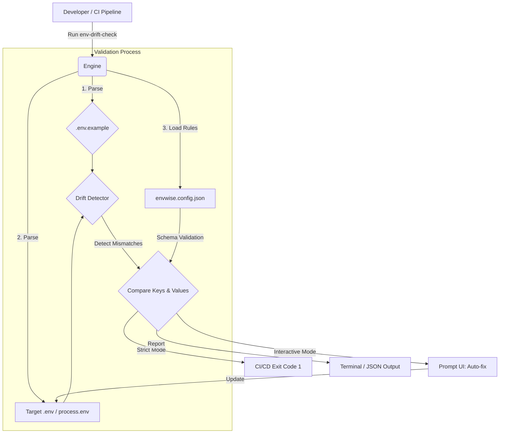

# env-drift-check

<div align="center">

**The all-in-one CLI for environment variable validation, drift detection, and deployment safety.**

[](https://npmjs.org/package/env-drift-check)
[](https://npm-stat.com/charts.html?package=env-drift-check)
[](https://opensource.org/licenses/MIT)
[](https://www.typescriptlang.org/)
[](https://nodejs.org/)
[](#)
[](#)

*Detect missing `.env` variables, enforce schema validation, scan your codebase, diff environments, audit git safety — all from one CLI. A zero-config alternative to `dotenv-safe` and `envalid` that requires no code changes.*

[Installation](#-installation) • [Quick Start](#-quick-start) • [Commands](#-all-commands) • [Schema Config](#%EF%B8%8F-configuration-envwiseconfigjson) • [CI/CD](#-cicd-integration) • [Pre-commit Hook](#-pre-commit-hook-husky) • [Library Usage](#-programmatic-usage) • [Changelog](#-changelog) • [Roadmap](#-roadmap)

</div>

<div align="center">
  
</div>

---

## ⚡ See It In Action

```bash
npx env-drift-check

✔ Loaded: .env
✔ Base: .env.example

✖ Missing keys:
  - DATABASE_URL
  - STRIPE_SECRET_KEY

⚠ Unused keys:
  - OLD_API_KEY

❌ Validation failed: PORT must be a number
```

**Fix everything interactively in one command:**

```bash
npx env-drift-check -i
```

---

## 💡 The Problem It Solves

Managing `.env` files across a team or across deployment environments (development, staging, production) is one of the most error-prone parts of any project:

- **Missing variables** cause unexpected runtime crashes in production.
- **Wrong types** — a string `"false"` instead of a boolean — create silent logic bugs.
- **Onboarding new developers** means sharing secrets over Slack or debugging an outdated `.env.example` for hours.
- **No visibility** into which environment variables your codebase actually uses vs. what is documented.
- **Leaked `.env` files** in git history expose secrets permanently.

**env-drift-check** solves all of this from a single CLI tool — with zero code changes to your application.

---

## 🎯 Real-World Use Cases

### "Works on My Machine" Onboarding
A new developer clones the repo and gets cryptic errors. `npx env-drift-check -i` immediately surfaces every missing variable, prompts them with real-time schema validation, masks secret inputs, and writes the result cleanly to `.env`. Onboarding goes from hours to seconds.

### Silent Production Crash Prevention
Add `npx env-drift-check --system-env --strict` to your GitHub Actions workflow. If any required variable is missing or fails validation, the pipeline exits with code `1` before deployment — blocking the broken build at the gate.

### Ghost Variable Cleanup
`npx env-drift-check scan` cross-references every `process.env.*` reference in your JS/TS source against `.env.example`. Instantly see which documented variables are dead code and which code references are undocumented.

### Environment Diff for Debugging
`npx env-drift-check diff .env.staging .env.production` shows exactly which variables differ between two environments — the fastest way to debug a "works in staging, fails in prod" incident.

### Git Secret Leak Audit
`npx env-drift-check audit` checks every `.env*` file against `.gitignore`, live git tracking, and your full git history. Catches leaks before they become a breach.

---

## 🚀 Features

- 🔍 **Environment Drift Detection** — Compares `.env` against `.env.example`. Finds missing keys and ghost/extra keys.
- 🛡️ **Schema Validation** — Enforce `string`, `number`, `boolean`, `enum`, `email`, `url`, and `regex` types via `envwise.config.json`. No code changes required.
- 🔑 **Codebase Scanner** — Scans JS/TS source for `process.env.X`, `const { X } = process.env`, and `import.meta.env.X` (Vite). Reports undocumented or dead variables.
- 📊 **Environment Diff** — Side-by-side comparison of two `.env` files showing added, removed, and changed keys.
- 🔐 **Git Safety Audit** — Detects `.env` files missing from `.gitignore`, currently tracked by git, or found in git history.
- 🧂 **Entropy-Based Secret Scoring** — Flags low-entropy secrets using Shannon entropy math — not a simple blocklist.
- 📁 **Template Generator** — Creates or updates `.env.example` from your local `.env`, stripping values and preserving formatting.
- 🪄 **Interactive Auto-fix Wizard** — Prompts for missing variables with live validation and secret masking.
- ⚡ **Process Environment Fallback** — Validates against `process.env` (via `--system-env`) for containers and serverless.
- ⚙️ **JSON Output** — `--format json` for piping results into Slack bots, custom dashboards, or other toolchains.
- ⚠️ **Variable Deprecation** — Flag legacy keys with custom migration warnings.
- 📑 **High-Fidelity Formatting** — Preserves inline comments, blank lines, and key order when writing back to `.env`.
- 🔄 **Multi-Environment Support** — Check all `.env*` files simultaneously with `--all`.
- 🚦 **CI/CD Ready** — `--strict` mode exits with code `1` on any validation failure.

---

## 🆚 How Does It Compare?

| Feature | `dotenv-safe` | `envalid` | **`env-drift-check`** |
| :--- | :---: | :---: | :---: |
| Missing key detection | ✅ | ✅ | ✅ |
| Schema / type validation | ❌ | ✅ (in code) | ✅ (JSON config) |
| No code changes required | ❌ | ❌ | ✅ |
| Interactive CLI fix wizard | ❌ | ❌ | ✅ |
| Codebase scanner | ❌ | ❌ | ✅ |
| Diff two env files | ❌ | ❌ | ✅ |
| Git safety audit | ❌ | ❌ | ✅ |
| Entropy-based secret check | ❌ | ❌ | ✅ |
| Formatting preservation | ❌ | ❌ | ✅ |
| Multi-env file check | ❌ | ❌ | ✅ |
| CI/CD strict mode | ❌ | ❌ | ✅ |
| Zero runtime code changes | ❌ | ❌ | ✅ |

---

## 🏗 Architecture & Flow


```mermaid
graph TD
    A[Developer / CI Pipeline] -->|Run env-drift-check| B(Engine)

    subgraph Validation Process
    B -->|1. Parse| C{.env.example}
    B -->|2. Parse| D[Target .env / process.env]
    B -->|3. Load Rules| E[envwise.config.json]

    C --> F{Drift Detector}
    D --> F

    F -->|Detect Mismatches| G{Compare Keys & Values}
    E -->|Schema Validation| G
    end

    G -->|Interactive Mode| H[Prompt UI: Auto-fix]
    H -->|Update| D

    G -->|Strict Mode| I[CI/CD Exit Code 1]
    G -->|Report| J[Terminal / JSON Output]
```

---

## 📦 Installation

```bash
# Install as a dev dependency
npm install --save-dev env-drift-check

# Or use directly without installing
npx env-drift-check
```

**Supported environments:** Node.js ≥ 16, npm, pnpm, yarn. Works with Express, Next.js, Vite, Fastify, NestJS, Remix, SvelteKit, and any Node.js project.

---

## ⚡ Quick Start

### 1. Initialize

Bootstrap a config file and `.env.example` in your project root:

```bash
npx env-drift-check init
```

```text
✅ Created envwise.config.json
✅ Created .env.example

Setup complete! Run 'npx env-drift-check -i' to sync your .env file.
```

> [!TIP]
> See the [Demo App](https://github.com/shashi089/env-drift-check/tree/main/examples/demo-app) for a complete real-world integration example.

### 2. Run Interactive Setup

When you clone a repo or a teammate adds new variables:

```bash
npx env-drift-check -i
```


---

## 🛠️ Step-by-Step Integration Guide

### Step 1: Initialize configuration

```bash
npx env-drift-check init
```

### Step 2: Define your validation schema

Edit `envwise.config.json` to add type rules for each variable:

```json
{
  "baseEnv": ".env.example",
  "rules": {
    "PORT": {
      "type": "number",
      "min": 3000,
      "max": 9999,
      "description": "HTTP server port"
    },
    "DATABASE_URL": {
      "type": "url",
      "required": true
    },
    "NODE_ENV": {
      "type": "enum",
      "values": ["development", "staging", "production", "test"]
    },
    "DEBUG_MODE": {
      "type": "boolean",
      "mustBeFalseIn": "production"
    },
    "API_SECRET_KEY": {
      "type": "string",
      "checkSecretStrength": true,
      "description": "Must pass entropy check"
    },
    "LEGACY_VAR": {
      "type": "string",
      "deprecated": "Migrate to NEW_CONFIG_VAR."
    }
  }
}
```

### Step 3: Scan your codebase

Find every `process.env` reference in your source code and compare against `.env.example`:

```bash
npx env-drift-check scan
```

```text
🔍 Scanning codebase for process.env references...
Scanned 12 source file(s).

🔑 Environment variables referenced in code:
 - API_SECRET_KEY
 - DATABASE_URL
 - NODE_ENV
 - PORT

❌ Missing in reference template (referenced in code but not in example):
 - JWT_SECRET
```

Auto-append missing keys to `.env.example`:

```bash
npx env-drift-check scan --fix
```

### Step 4: Generate `.env.example`

When you add new variables locally, regenerate the example template (values are stripped, comments and formatting are preserved):

```bash
npx env-drift-check gen-example
```

### Step 5: Onboard new developers

A developer who just cloned the repo runs:

```bash
npx env-drift-check -i
```

Every missing variable is prompted with live validation. Secret inputs are masked. Result is written cleanly to `.env`.

### Step 6: Add a CI/CD build gate

Validate injected secrets before every deployment:

```bash
npx env-drift-check --system-env --strict
```

JSON output for custom integrations (Slack, PagerDuty, dashboards):

```bash
npx env-drift-check --system-env --strict --format json
```

```json
{
  ".env": {
    "success": false,
    "result": {
      "missing": ["DATABASE_URL"],
      "errors": [
        { "key": "API_SECRET_KEY", "message": "API_SECRET_KEY must be at least 8 characters long in production" }
      ],
      "warnings": ["LEGACY_VAR is deprecated. Migrate to NEW_CONFIG_VAR."],
      "extra": [],
      "mismatches": []
    }
  }
}
```

---

## ⚙️ Configuration (`envwise.config.json`)

### Full Reference

```json
{
  "baseEnv": ".env.example",
  "rules": {
    "PORT":         { "type": "number",  "min": 1024, "max": 65535, "description": "HTTP server port" },
    "NODE_ENV":     { "type": "enum",    "values": ["development", "production", "test", "staging"] },
    "DEBUG_MODE":   { "type": "boolean", "mustBeFalseIn": "production" },
    "DATABASE_URL": { "type": "url",     "required": true },
    "ADMIN_EMAIL":  { "type": "email" },
    "API_KEY":      { "type": "regex",   "regex": "^sk_(test|live)_[0-9a-zA-Z]{24}$" },
    "JWT_SECRET":   { "type": "string",  "checkSecretStrength": true },
    "OLD_KEY":      { "type": "string",  "deprecated": "Use NEW_KEY instead." }
  }
}
```

### Validation Types

| Type | Options | Description |
|---|---|---|
| `string` | `min`, `max`, `checkSecretStrength` | Length bounds. Entropy check for secrets. |
| `number` | `min`, `max` | Numeric range. Rejects non-numeric strings. |
| `boolean` | `mustBeFalseIn` | Must be `"true"` or `"false"`. Conditional safety check. |
| `enum` | `values: []` | Restricts to an allowed set of strings. |
| `email` | — | Standard email format validation. |
| `url` | — | Valid URI (supports `https://`, `postgres://`, etc). |
| `regex` | `regex` | Custom regular expression. |

### Rule Options

| Option | Type | Description |
|---|---|---|
| `required` | `boolean` | Defaults to `true`. Set `false` to make optional. |
| `description` | `string` | Shown in interactive prompts to guide developers. |
| `checkSecretStrength` | `boolean` | Scores entropy. Auto-enabled for keys containing `SECRET` or `PASSWORD`. |
| `mustBeFalseIn` | `string` | Environment name where a boolean must be `false` (e.g. `"production"`). |
| `deprecated` | `boolean \| string` | Emits a deprecation warning. Provide a string for a migration message. |

---

## 💻 All Commands

| Command | Description |
|---|---|
| `env-drift-check` | Check `.env` against `.env.example` (default) |
| `env-drift-check -i` | Interactive wizard — prompt for missing variables |
| `env-drift-check --strict` | Exit code `1` on any issue (for CI/CD) |
| `env-drift-check --all` | Check all `.env*` files in the directory |
| `env-drift-check --system-env` | Validate against `process.env` (containers/serverless) |
| `env-drift-check --format json` | JSON output for toolchain integration |
| `env-drift-check scan` | Scan codebase for `process.env` usage vs `.env.example` |
| `env-drift-check scan --fix` | Auto-append missing keys to `.env.example` |
| `env-drift-check diff <a> <b>` | Side-by-side diff of two `.env` files |
| `env-drift-check audit` | Check `.env` files for git tracking and history leaks |
| `env-drift-check gen-example` | Generate `.env.example` from your local `.env` |
| `env-drift-check init` | Scaffold `envwise.config.json` and `.env.example` |

---

## 🔁 CI/CD Integration

### GitHub Actions

Copy the workflow into `.github/workflows/env-check.yml` (a ready-to-use file is already included in this repo):

```yaml
name: Environment Validation

on:
  push:
    branches: [main, develop]
    paths:
      - '.env.example'
      - 'envwise.config.json'
  pull_request:
    paths:
      - '.env.example'
      - 'envwise.config.json'

jobs:
  env-drift-check:
    name: Validate Environment Configuration
    runs-on: ubuntu-latest
    steps:
      - uses: actions/checkout@v4
      - uses: actions/setup-node@v4
        with:
          node-version: '20'

      - name: Check environment drift
        run: npx env-drift-check --system-env --strict --format json
        env:
          NODE_ENV: production
          PORT: ${{ secrets.PORT }}
          DATABASE_URL: ${{ secrets.DATABASE_URL }}
          API_SECRET_KEY: ${{ secrets.API_SECRET_KEY }}

      - name: Scan for undocumented env vars
        run: npx env-drift-check scan

      - name: Audit .env git safety
        run: npx env-drift-check audit
        continue-on-error: true
```

> A ready-to-use workflow is already included at [`.github/workflows/env-check.yml`](.github/workflows/env-check.yml).

### Other CI Providers

```bash
# GitLab CI / Bitbucket Pipelines / CircleCI / Jenkins
npx env-drift-check --system-env --strict
```

Add your required variables as CI/CD environment secrets and run this command in the validation stage. Exit code `1` fails the build automatically.

---

## 🪝 Pre-commit Hook (Husky)

Block commits that would introduce drift into your repository.

### Setup

```bash
npm install --save-dev husky
npx husky init
echo "npx env-drift-check --strict" > .husky/pre-commit
```

### With lint-staged (monorepos)

Only run the check when `.env.example` or the config file changes:

```bash
npm install --save-dev lint-staged
```

Add to `package.json`:

```json
{
  "lint-staged": {
    ".env.example": "npx env-drift-check --strict",
    "envwise.config.json": "npx env-drift-check --strict"
  }
}
```

```bash
echo "npx lint-staged" > .husky/pre-commit
```

---

## 📦 Programmatic Usage

Use `env-drift-check` as a library to enforce environment health at application startup.

```typescript
import { checkDrift, loadConfig, parseEnv, report } from 'env-drift-check';
import path from 'path';

const config = loadConfig();
const baseEnv = parseEnv(path.resolve('.env.example'));
const targetEnv = parseEnv(path.resolve('.env'));

const result = checkDrift(baseEnv, targetEnv, config);

if (result.missing.length || result.errors.length) {
  console.error('Environment check failed — refusing to start.');
  report(result);
  process.exit(1);
}
```

**Exported API:**

| Export | Description |
|---|---|
| `checkDrift(base, target, config)` | Returns a `DriftResult` with missing, extra, errors, warnings, mismatches |
| `validateValue(key, value, rule, env)` | Validates a single value against a rule |
| `parseEnv(filePath)` | Parses a `.env` file into a key-value record |
| `loadConfig()` | Loads `envwise.config.json` (or returns defaults) |
| `updateEnvFile(filePath, values)` | Writes values to a `.env` file preserving formatting |
| `generateExampleFile(src, dest)` | Creates a `.env.example` from a `.env` |
| `scanCodebase(dir)` | Returns all `process.env` references found in source files |

---

## 📚 Examples

- [**Basic Usage**](https://github.com/shashi089/env-drift-check/tree/main/examples/basic-usage) — Minimal file sync example.
- [**Real-World Demo App**](https://github.com/shashi089/env-drift-check/tree/main/examples/demo-app) — Express app with fail-fast startup validation and CI/CD integration.

---

## 📤 Exit Codes

| Code | Meaning |
|---|---|
| `0` | All checks passed — no drift, no validation errors |
| `1` | Missing keys, validation errors, or strict mode triggered |

---

## 🌟 Best Practices

1. **Never commit `.env`** — Add it to `.gitignore`. Run `npx env-drift-check audit` to verify.
2. **Always commit `.env.example` and `envwise.config.json`** — These are your team's source of truth.
3. **Use `-i` locally** for onboarding and after pulling changes that modify `.env.example`.
4. **Use `--strict --system-env` in CI/CD** — Fail the build before deploying a misconfigured environment.
5. **Run `scan` regularly** — Catch undocumented variables before they reach production.
6. **Auto-prompt on install** via `package.json`:
   ```json
   { "scripts": { "prepare": "env-drift-check -i" } }
   ```

---

## 📋 Changelog

See [CHANGELOG.md](CHANGELOG.md) for the full version history.

---

## 🗺 Roadmap

See [ROADMAP.md](ROADMAP.md) for the full adoption roadmap.

**Upcoming in v0.4.x:**
- Framework prefix awareness (Next.js `NEXT_PUBLIC_`, Vite `VITE_`)
- Cross-variable conditional rules (`requiredIf`)
- `default` values in schema
- `--watch` mode
- SARIF output for GitHub Security tab

---

## 🤝 Contributing

Contributions are welcome!

1. Fork the repository
2. Create a feature branch: `git checkout -b feature/your-feature`
3. Commit: `git commit -m 'feat: add your feature'`
4. Push: `git push origin feature/your-feature`
5. Open a Pull Request

Please run `npm test` before submitting. All 47 tests must pass.

---

## 📄 License

MIT — see [LICENSE](LICENSE) for details.

---

<div align="center">

Built with care for better Developer Experience by [Shashidhar Naik](https://github.com/shashi089)

*If this tool saves you time, consider giving it a ⭐ on GitHub.*

</div>
