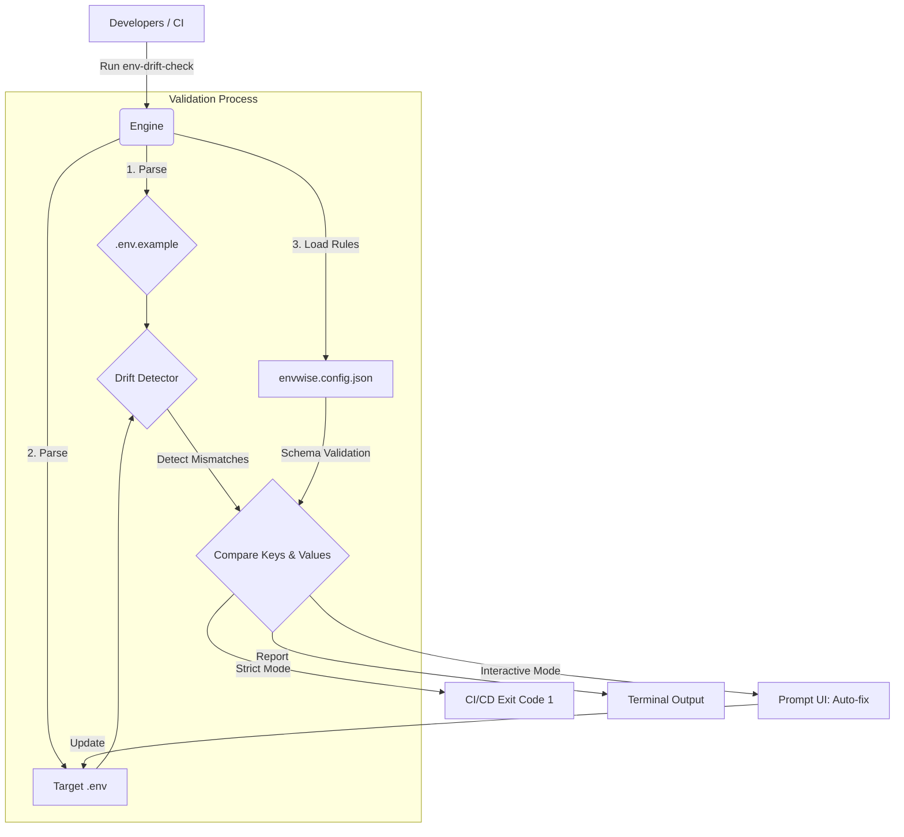

# env-drift-check

<div align="center">

**Interactive .env validator, schema checker, and codebase scanner for modern development teams.**

[](https://npmjs.org/package/env-drift-check)
[](https://npm-stat.com/charts.html?package=env-drift-check)
[](https://opensource.org/licenses/MIT)

*A zero-dependency TypeScript alternative to `dotenv-safe` and `envalid` that automatically detects environment drift, performs type-safe validation, and scans your codebase for missing variables.*

[Installation](#installation) • [Features](#features) • [Quick Start](#quick-start) • [Step-by-Step Example](#-step-by-step-project-integration-example) • [Configuration](#-configuration-envwiseconfigjson) • [Library Usage](#-programmatic-usage) • [Roadmap](#-roadmap)

</div>

<div align="center">
  
</div>

---

## ⚡ See It In Action

```bash
npx env-drift-check

✔ Loaded: .env
✔ Base: .env.example

✖ Missing keys:
  - DATABASE_URL
  - STRIPE_SECRET_KEY

⚠ Unused keys:
  - OLD_API_KEY

❌ Validation failed: PORT must be a number
```

👉 **Fix instantly with interactive mode:**

```bash
npx env-drift-check -i
```

---

## 💡 The Problem It Solves

Managing `.env` files across a team of developers or multiple deployment environments (development, staging, production) is notoriously error-prone. 

- **Missing variables** lead to unexpected runtime crashes.
- **Incorrect data types** (e.g., passing a string `"false"` instead of a proper boolean) cause silent logical bugs.
- **Onboarding new developers** often involves insecurely sharing `.env` files over Slack, or fighting with an outdated `.env.example`.

**env-drift-check** bridges this gap. It provides real-time drift detection to ensure your local environments match the blueprint, an interactive CLI to fix missing variables instantly, and a robust schema validator to enforce types and formats.

---

## 🎯 Real-World Developer Use Cases

Here are three common real-world scenarios where `env-drift-check` saves developers hours of debugging and frustration.

### Use Case 1: The "Works on My Machine" Onboarding Nightmare
* **The Problem**: A new developer clones your team's repository. They copy `.env.example` to `.env` but find out it is outdated. They spend half a day debugging connection timeouts, only to realize a senior developer added a new `STRIPE_WEBHOOK_SECRET` variable last week and forgot to document it.
* **How it helps**: The developer simply runs `npx env-drift-check -i`. The CLI immediately flags the missing variable, prompts them to enter their local test secret with secure input masking, validates it on the fly, and appends it to their local `.env` with comments preserved. Onboarding time drops from hours to seconds.

### Use Case 2: The Silent Production Configuration Crash
* **The Problem**: You push a hotfix to production. The deploy succeeds, but the application crashes on startup because the production container is missing a new required config key `REDIS_PASSWORD` that was only defined in local `.env` files.
* **How it helps**: You configure your CI/CD pipeline (e.g., GitHub Actions) to run `npx env-drift-check --system-env --strict`. If any environment variable is missing or fails the validation rules, the pipeline fails immediately before deployment, preventing public downtime.

### Use Case 3: The Ghost/Unused Variable Bloat
* **The Problem**: Over years of development, your `.env.example` accumulates 50+ variables. Half of them are obsolete (e.g. `OLD_SMS_GATEWAY_URL`), but developers are afraid to remove them because they don't know if they are still used in the codebase.
* **How it helps**: Run `npx env-drift-check scan`. The tool analyzes your source code files and reports all "Unused in code" variables defined in `.env.example` that do not exist in your codebase, allowing you to clean up your repository configurations safely.

---

## 🏗 Architecture & Flow


```mermaid
graph TD
    A[Developers / CI] -->|Run env-drift-check| B(Engine)
    
    subgraph Validation Process
    B -->|1. Parse| C{.env.example}
    B -->|2. Parse| D[Target .env]
    B -->|3. Load Rules| E[envwise.config.json]
    
    C --> F{Drift Detector}
    D --> F
    
    F -->|Detect Mismatches| G{Compare Keys & Values}
    E -->|Schema Validation| G
    end

    G -->|Interactive Mode| H[Prompt UI: Auto-fix]
    H -->|Update| D
    
    G -->|Strict Mode| I[CI/CD Exit Code 1]
    G -->|Report| J[Terminal Output]
```

---

## 🚀 Features

- 🔍 **Environment Drift Detection**: Automatically compares your local `.env` against the base `.env.example`. Detects both **missing keys** and **extra/ghost keys**.
- 🛡️ **Extensive Schema Validation**: Enforce `string`, `number`, `boolean`, `enum`, `email`, `url`, and custom `regex` validations via `envwise.config.json`.
- 🔑 **Codebase Scanner**: Recursively scans JS/TS code for `process.env` references to find undocumented variables or dead configurations (`scan` command).
- 📁 **Template Generator**: Safely creates or updates your `.env.example` file directly from `.env`, preserving formatting and stripping secrets (`gen-example` command).
- ⚡ **Process Environment Fallback**: Optionally validates against `process.env` (via the `--system-env` flag) to support containerized and serverless environments.
- ⚙️ **JSON Output Mode**: Serializes check outputs in JSON format (`--format json` flag) for seamless integration with custom toolchains.
- 🔒 **Security Entropy Checks**: Basic strength validation preventing weak passwords or short secrets in production configurations.
- ⚠️ **Variable Deprecation**: Gracefully flag legacy keys with custom deprecation/migration warnings.
- 🪄 **Interactive Auto-fix Wizard**: A beautiful CLI experience that prompts you for missing variables.
- 🔐 **Security Conscious**: Automatically masks inputs for keys containing `SECRET` or `PASSWORD` during interactive setup.
- 📑 **High-Fidelity Formatting**: Inherently preserves your original inline comments, empty lines, bespoke spacing, and absolute key ordering when patching your `.env` file.
- 🔄 **Multi-Environment Support**: Validate all `.env*` files in your project simultaneously with the `--all` flag.
- 🚦 **CI/CD Ready**: Native `--strict` mode to fail builds on validation errors, ensuring zero-drift deployments.

### ✨ Interactive Fix (Best Feature)

```bash
$ npx env-drift-check -i

Missing: DATABASE_URL
Enter value: postgres://localhost:5432/db

✔ Added to .env
✔ All variables synced
```

### How Does It Compare?

| Feature | `dotenv-safe` | `envalid` | **`env-drift-check`** |
| :--- | :---: | :---: | :---: |
| **Missing Keys Detection** | ✅ | ✅ | ✅ |
| **CLI Interactive Fix** | ❌ | ❌ | ✅ |
| **Schema Validation** | ❌ | ✅ (Code) | ✅ (JSON) |
| **Cross-Env File Check** | ❌ | ❌ | ✅ |
| **No Code Integration Needed**| ❌ | ❌ | ✅ |
| **Preserves Formatting** | ❌ | ❌ | ✅ |

👉 **env-drift-check works purely as a standalone CLI tool --- no code changes required!**

---

## 📦 Installation

Install `env-drift-check` as a development dependency:

```bash
npm install --save-dev env-drift-check
```

Or run it directly using `npx` without installing:

```bash
npx env-drift-check init
```

---

## ⚡ Quick Start

### 1. Initialize the Project

Bootstrap your repository with a default configuration and `.env.example`:

```bash
npx env-drift-check init
```

> [!TIP]
> Check out our [Demo Project](https://github.com/shashi089/env-drift-check/tree/main/examples/demo-app) to see how to integrate this into a real application workflow.

*Output:*
```text
✅ Created envwise.config.json
✅ Created .env.example

Setup complete! Run 'npx env-drift-check -i' to sync your .env file.
```

### 2. Run an Interactive Check

If you just cloned a repo, check for missing environment variables and fill them in right from the terminal:

```bash
npx env-drift-check -i
```


Once completed, your `.env` file is automatically updated!


---

## 🛠️ Step-by-Step Project Integration Example

Here is a full demonstration of how to integrate `env-drift-check` into your development lifecycle, from setting up validation rules to CI/CD environment checking.

### Step 1: Initialize the configuration files
Run the `init` command at the root of your project:
```bash
npx env-drift-check init
```
This boots up the default configuration file `envwise.config.json` and a `.env.example` file.

### Step 2: Define your Environment Validation Schema
Edit the generated `envwise.config.json` file. Let's add rules for a database URL, server port, environment mode, and Stripe API keys:
```json
{
  "baseEnv": ".env.example",
  "rules": {
    "PORT": { 
      "type": "number", 
      "min": 3000, 
      "max": 9999,
      "description": "App port" 
    },
    "DATABASE_URL": { 
      "type": "url", 
      "required": true 
    },
    "NODE_ENV": { 
      "type": "enum", 
      "values": ["development", "production", "test"] 
    },
    "API_SECRET_KEY": { 
      "type": "string", 
      "checkSecretStrength": true, 
      "description": "Sensitive application secret" 
    },
    "LEGACY_VAR": {
      "type": "string",
      "deprecated": "LEGACY_VAR is deprecated. Please migrate to NEW_CONFIG_VAR."
    }
  }
}
```

### Step 3: Scan Codebase to Detect Missing variables
As you develop, you might reference environment variables in your Node/Express code (e.g. `process.env.DATABASE_URL`, `process.env.JWT_SECRET`). Run the scanner command to audit your codebase:
```bash
npx env-drift-check scan
```
**Example CLI Output:**
```text
🔍 Scanning codebase for process.env references...
Scanned 12 source file(s).

🔑 Environment variables referenced in code:
 - API_SECRET_KEY
 - DATABASE_URL
 - NODE_ENV
 - PORT

❌ Missing in reference template (referenced in code but not in example):
 - API_SECRET_KEY
 - DATABASE_URL
```
This tells you exactly which code variables are missing from `.env.example` or config rules.

### Step 4: Automatically Generate/Update `.env.example`
Once you add new variables locally in your `.env` file, generate a pristine `.env.example` automatically so other developers can run the project:
```bash
npx env-drift-check gen-example
```
*Note: This command parses your local `.env`, removes actual values (to protect passwords/secrets), retains your block comments and spacing format, and prompts for confirmation if `.env.example` already exists.*

### Step 5: Onboard Team Members with Interactive Mode
When a new developer clones the repository, they won't have a `.env` file. They can run:
```bash
npx env-drift-check -i
```
This interactive prompt queries them for each missing environment variable, validates their inputs in real-time according to the schema rules, masks secret key entries during typing, and writes them cleanly into a newly created `.env` file.

### Step 6: Setup a CI/CD build gate
In staging/production pipelines (e.g., GitHub Actions), physical `.env` files are not checked in. Use the `--system-env` fallback flag combined with `--strict` mode to validate the environment variables injected into the system shell by the hosting provider:
```bash
npx env-drift-check --system-env --strict
```
If you wish to integrate validation results with external tools or notifications (e.g. Slack bots), query the report in JSON format:
```bash
npx env-drift-check --system-env --strict --format json
```
**Example JSON Output (on validation failure):**
```json
{
  ".env": {
    "success": false,
    "result": {
      "missing": ["DATABASE_URL"],
      "extra": [],
      "errors": [
        {
          "key": "API_SECRET_KEY",
          "message": "API_SECRET_KEY must be at least 8 characters long in production"
        }
      ],
      "warnings": [
        "LEGACY_VAR is deprecated. Please migrate to NEW_CONFIG_VAR."
      ],
      "mismatches": []
    }
  }
}
```
This exits with code `1`, causing the CI build to fail and preventing deployment crashes.

---

## ⚙️ Configuration (`envwise.config.json`)

To unlock the full power of the schema validator, define rules in an `envwise.config.json` file at the root of your project.

### Sample Configuration

```json
{
  "baseEnv": ".env.example",
  "rules": {
    "PORT": { 
      "type": "number", 
      "min": 1024, 
      "max": 65535,
      "description": "The port the HTTP server binds to"
    },
    "NODE_ENV": { 
      "type": "enum", 
      "values": ["development", "production", "test", "staging"] 
    },
    "DEBUG_MODE": { 
      "type": "boolean", 
      "mustBeFalseIn": "production" 
    },
    "DATABASE_URL": { 
      "type": "url",
      "required": true
    },
    "ADMIN_EMAIL": {
      "type": "email"
    },
    "API_KEY": {
      "type": "regex",
      "regex": "^sk_(test|live)_[0-9a-zA-Z]{24}$",
      "description": "Stripe API Key format"
    }
  }
}
```

### Supported Validation Types

| Type | Options | Description |
|---|---|---|
| `string` | `min`, `max` | Enforce string length bounds. |
| `number` | `min`, `max` | Enforce numeric value limits. |
| `boolean` | `mustBeFalseIn` | Ensure value is "true" or "false". Can conditionally reject "true" in specific environments (e.g. production safety). |
| `enum` | `values: []` | Restrict the variable to a specific set of allowed strings. |
| `email` | - | Validates against a standard email regex. |
| `url` | - | Validates standard URI formats. |
| `regex` | `regex` | Custom regular expression validation. |

---

## 📦 Programmatic Usage

`env-drift-check` can also be used as a library in your Node.js applications to enforce environment health at startup.

```typescript
import { checkDrift, loadConfig, parseEnv, report } from 'env-drift-check';
import path from 'path';

const config = loadConfig();
const baseEnv = parseEnv(path.resolve('.env.example'));
const targetEnv = parseEnv(path.resolve('.env'));

const result = checkDrift(baseEnv, targetEnv, config);

if (result.missing.length || result.errors.length) {
  console.error("Environment check failed!");
  report(result);
  process.exit(1);
}
```

---

## 📚 Examples

Explore our sample projects to see `env-drift-check` in action:

- [**Basic Usage**](https://github.com/shashi089/env-drift-check/tree/main/examples/basic-usage): A minimal example showing file synchronization.
- [**Real-World Demo App**](https://github.com/shashi089/env-drift-check/tree/main/examples/demo-app): A complete Express-style app with programmatic "fail-fast" bootstrap logic and CI/CD integration.

---

## 💻 CLI Usage Examples

Check defaults:
```bash
npx env-drift-check
```

Launch Interactive fix:
```bash
npx env-drift-check -i
```

Strict mode (fails with exit code 1):
```bash
npx env-drift-check --strict
```

Multi-Environment check:
```bash
npx env-drift-check --all
```

Fallback to system environment variables (useful in CI/CD pipelines):
```bash
npx env-drift-check --system-env
```

Output reports in JSON format:
```bash
npx env-drift-check --format json
```

Scan codebase for environment variable alignment:
```bash
npx env-drift-check scan
```

Generate `.env.example` automatically from your `.env`:
```bash
npx env-drift-check gen-example
```

---

## 📤 Exit Codes

- `0` → No issues found.
- `1` → Schema validation failed or missing keys detected (in `--strict` mode).

---

## 🌟 Best Practices

1. **Never commit `.env` or `.env.*` files!** Ensure they are in your `.gitignore`.
2. **Always commit `.env.example`** and `envwise.config.json` as the source of truth for your team.
3. **Use the Interactive Mode** (`-i`) locally during development and onboarding.
4. **Use Strict Mode** (`--strict`) in your CI/CD pipeline to catch missing production variables early.
5. **Add it to your `postinstall` or `prepare` script** in `package.json` to auto-prompt new developers:
   ```json
   "scripts": {
     "prepare": "env-drift-check -i"
   }
   ```

---

## 🗺 Roadmap

- [x] Boolean conditional checks (`mustBeFalseIn`)
- [x] Interactive CLI prompts
- [x] Multi-file parsing (`--all`)
- [x] High-fidelity formatting preservation
- [x] **JSON Output Mode**: Provide `--format json` for reporting to integrate with other tooling pipelines.
- [x] **Secret Scanning**: Add basic entropy checks to prevent weak local passwords.
- [x] **Variable Deprecation**: Support marking keys as deprecated to gracefully remove them across teams.
- [x] **Auto-generate `.env.example`**: Create a base example from an existing `.env` (`gen-example`).
- [x] **Codebase Scanning**: Detect variables used in code (`process.env.X`) that are missing (`scan`).

---

## 🤝 Contributing

Contributions are always welcome! 

1. Fork the project
2. Create your Feature Branch (`git checkout -b feature/AmazingFeature`)
3. Commit your Changes (`git commit -m 'Add some AmazingFeature'`)
4. Push to the Branch (`git push origin feature/AmazingFeature`)
5. Open a Pull Request

---

## 📄 License

Distributed under the MIT License. See `LICENSE` for more information.

---

> Built with ❤️ for better Developer Experience by [Shashidhar Naik](https://github.com/shashi089)
